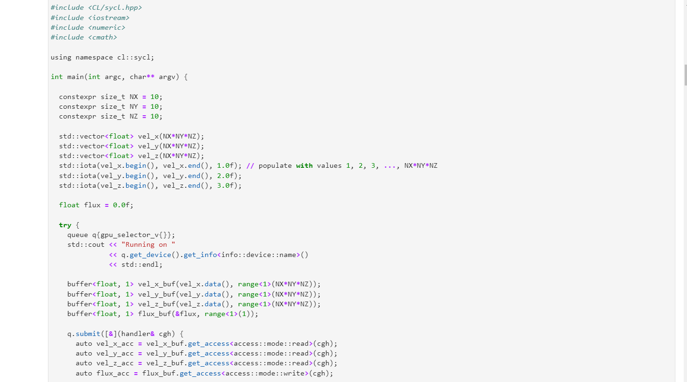
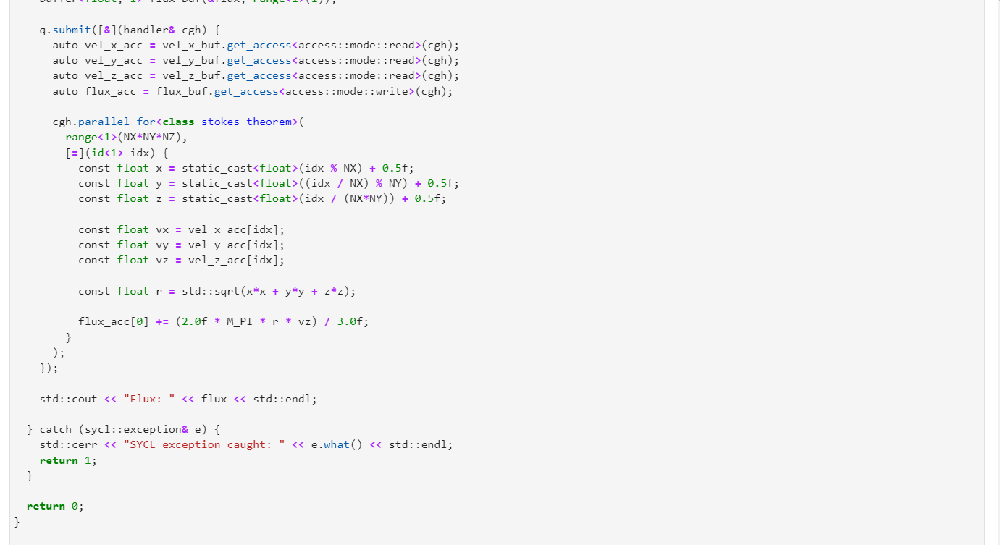
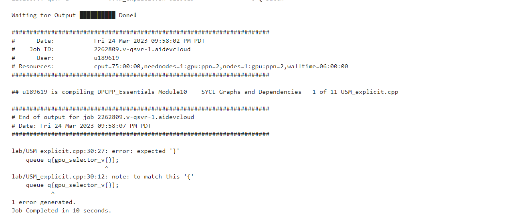

# OneAPI_SYKL
 
This repository contains all the information studied and created during the [OneAPI/SYCL](https://devcloud.intel.com/oneapi/) hackathon. SYCL is a higher-level programming model for heterogeneous computing that builds on top of standard C++. It allows developers to write code in a familiar C++ syntax and use modern C++ features such as templates and lambdas, while still leveraging the performance benefits of heterogeneous computing. 

# What is Stokes theorem
Stokes' theorem relates the circulation of a vector field around a closed curve in space to the flux of the curl of the vector field through a surface bounded by the curve. In polar coordinates, the theorem can be written as:

∮_C F ⋅ dr = ∬_S (∇ × F) ⋅ dS

where:

C is a closed curve in space, which can be expressed in polar coordinates as r(θ)
S is the surface bounded by the curve C
F is a vector field defined in the region containing S and C
dr is an infinitesimal element of arc length along the curve C, expressed in polar coordinates as r dθ
dS is an infinitesimal element of surface area, expressed in polar coordinates as r dr dθ
∇ × F is the curl of the vector field F

 
 
 
